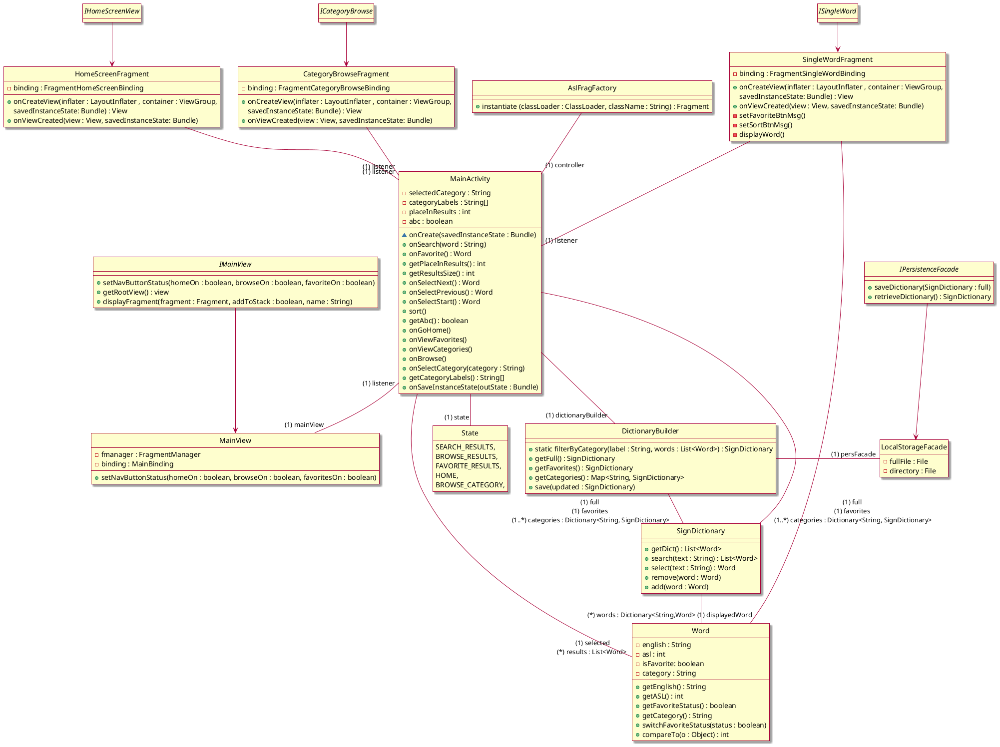
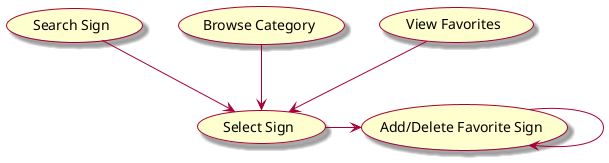
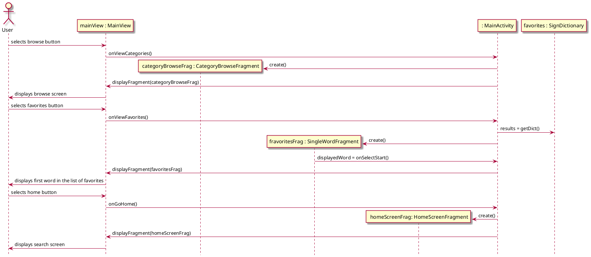
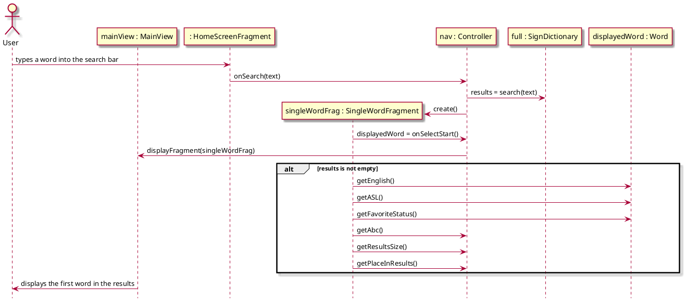
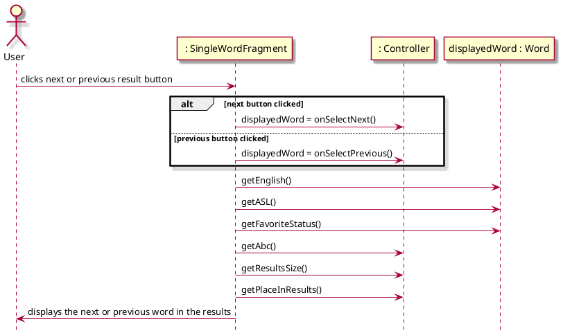
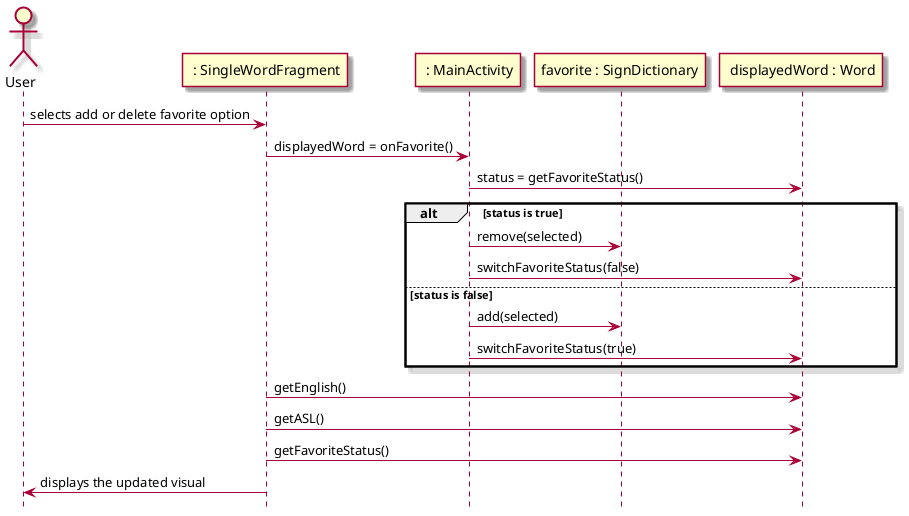
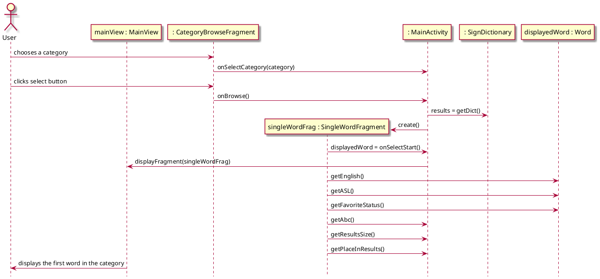

# App Design

## 1. Class Diagram

## 2. Feature Flow Chart

__Workflow Description__
 - The user opens the app
 - The navbar gives the user the option to search for a sign, browse a category, or view favorites.
 - If the user wants to search for a sign, the app displays the signs that are the result from their search. Then they can either add the search sign as their favorite or choose a new option from the navbar. So, on for other features as well.

## 3. Sequence Diagrams

__Navigate App (and View Favorites)__

__Search Sign__

__Select Sign__

__Add or Delete Favorite__

__Browse Category__
