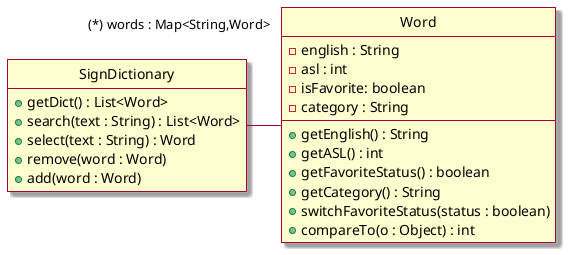
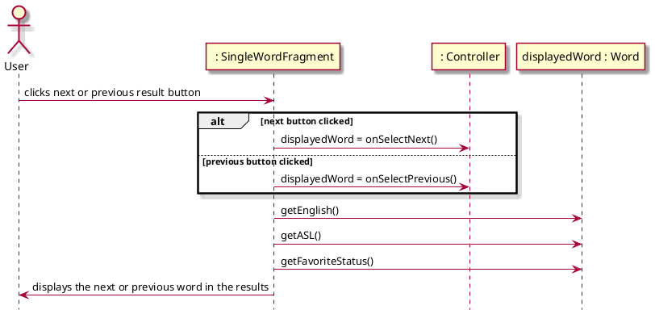
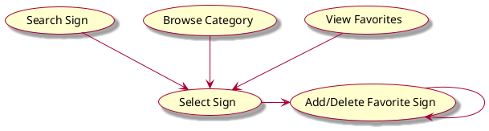

__Model Class Diagram__

```plantuml
@startuml
hide circle
hide empty members
skin rose

' classes

class SignDictionary{
+ getDict() : List<Word>
+ search(text : String) : List<Word>
+ select(text : String) : Word
+ remove(word : Word)
+ add(word : Word)

}
class Word {
- english : String
- asl : int
- isFavorite: boolean
- category : String
+ getEnglish() : String
+ getASL() : int
+ getFavoriteStatus() : boolean
+ getCategory() : String
+ switchFavoriteStatus(status : boolean)
+ compareTo(o : Object) : int

}

' associations

SignDictionary - " (*) words : Map<String,Word> " Word


@enduml
```

__Simplified sequence diagram for Select Sign__

```plantuml
@startuml
skin rose
hide footbox

actor User as user

participant " : SingleWordFragment" as ui
participant " : Controller" as nav
participant "displayedWord : Word" as word

user -> ui : clicks next or previous result button

alt next button clicked
ui -> nav : displayedWord = onSelectNext()
else previous button clicked
ui -> nav : displayedWord = onSelectPrevious()
end

ui -> word : getEnglish()
ui -> word : getASL()
ui -> word : getFavoriteStatus()


ui -> user : displays the next or previous word in the results
@enduml
```
__Feature Flow Chart__

```plantuml

@startuml

skin rose 

usecase "Search Sign" as search
usecase "Browse Category" as browse
usecase "View Favorites" as favoriteView
usecase "Add/Delete Favorite Sign" as favorite
usecase "Select Sign" as select


search --> select
browse --> select
favoriteView --> select
select -> favorite

favorite --> favorite 


@endum
```