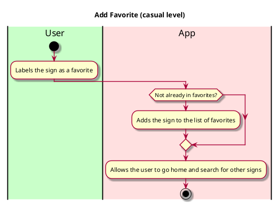

# Use case name: Add Favorite

__Description__: This feature allows the user to favorite the signs that they use most often in order to quickly access them. 

## 1. Primary actor and goals
__Caregivers/teachers__: Who do not know ASL, but want to easily and quickly translate the ASL signs they need to communicate with the children under their care.

## 2. Other stakeholders and their goals

* __Children/other adults__: Who use ASL, want to be understood and have their needs met.
* __Parents__: Want to be able to temporarily leave their deaf children under the care of adults who do not know ASL.

## 2. Preconditions

- The app is downloaded and open.
- User has browsed/ searched for the desired sign.

## 4. Postconditions

A new sign is saved in the favorite category.

## 4. Workflow

__Workflow Description__:
The user wants to favorite a sign they use a lot. 
- They search for the desired sign.
- They label the sign as a favorite by clicking in the favorite button.
- The system adds the sign to the list of favorites.
- The user can view the sign they favorited in the favorite sign category.
- The user can go home and search for more signs and add them to the favorite list.