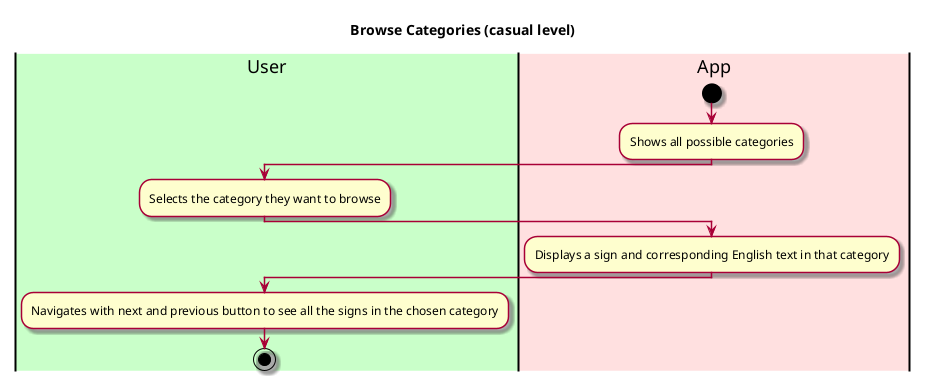

# Use case name: Browse Categories

__Description__: This feature allows a user to search for signs based on a category 
(like food, drinks, expression etc). This offers an alternative method to finding signs (other than searching)
and allows a user to explore all the signs the app has to offer.

## 1. Primary actor and goals
__Caregivers/teachers__: Who do not know ASL, but want to easily and quickly translate the ASL signs they need to communicate with the children under their care.

## 2. Other stakeholders and their goals

* __Children/other adults__: Who use ASL, want to be understood and have their needs met.
* __Parents__: Want to be able to temporarily leave their deaf children under the care of adults who do not know ASL.

## 2. Preconditions

The app is downloaded and open.
The user has chosen the option to browse categories.

## 4. Postconditions

* The collection of ASL signs and corresponding English words in the chosen category are displayed.
* A sign from the collection is selected. 

## 4. Workflow

__Workflow Description__:
The user wants to browse all the signs in a particular category (ie food).
- They select the desired category from the dropdown menu.
- The system displays one sign per time in that category.
- The user is able to navigate with next and previous button to see the signs 
or chose another category to browse.