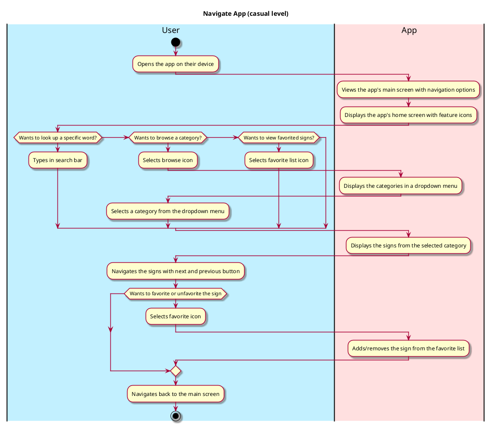

# Use Case: Navigate App

__Description__:
Users of the ASL App can explore and access various features and functionalities within the app thanks to the "Navigate App" use case, which offers a fluid and user-friendly experience.

## 1. Primary actor and goals
__User__:  The primary actor who wishes to use the  ASL app, access particular features, and take different actions in accordance with their requirements.

## 2. Other stakeholders and their goals
__Developers__: Ensure that users have an easy-to-use navigation experience.
__Educators__: Teachers and students may receive guidance on how to use the app successfully for learning sign language.

## 3. Preconditions
The app is installed and operational on the user's device.

## 4. Postconditions
The user accesses the intended features or content after successfully navigating through the program.

## 5. Workflow

__Workflow Description__:

The User opens the app on their device.
The Navigate App function takes the user to the app's home page, where navigation options and feature icons are displayed.
To access a particular section of the software, the User chooses an icon or feature from the home screen.
The Navigate App function directs the user to the chosen section or feature.
After that, the User can engage with the feature they have chosen by searching, examining their favourites, or browsing their sign language.
The User can repeat the process to return to the home screen if necessary or explore other options or search again for a new sign.

