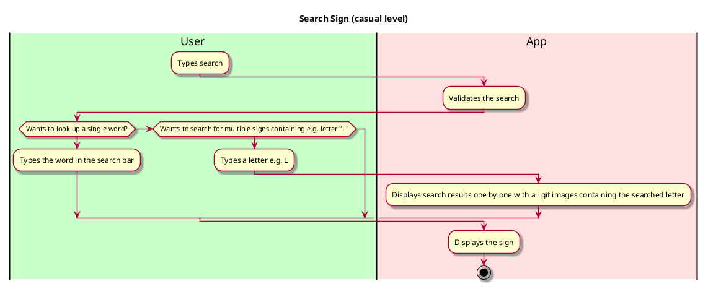

# Use case name: Search Sign

Description:
A key feature of the ASL App  is the "Search Sign" use case, which enables users to look up particular sign language translations. This use case is crucial for user engagement, and offers the translation from an English Word to a Gif Image.

## 1. Primary actor and goals

__User__: Who do not know ASL, and want to communicate with children/ others who use ASL.

## 2. Other stakeholders and their goals

* __Other Adults__: Who want to have their needs met and communicate;
* __Teachers__: Who have deaf students in class (that they don't necessarily have a sign-language translator in class).

## 2. Preconditions
* The application is launched and operational.

## 4. Postconditions
*  The user sees the translation through a gif image.

## 5. Workflow

__Workflow Description__:

The User wants to search for a word in ASL to communicate with ASL users.
The User interacts with the Search Bar feature in the App.
While the User continues to search for words:
- They enter the desired word in English.
- The System validates the search.
- The System returns a gif image displaying the ASL translation.
- If the user search for a certain letter, the system displays all the gifs containing that letter. The user can navigate with next and previous button to see all the signs starting with the given letter.
- The User can go home and search for additional words as needed.
- This workflow represents the main success scenario for the "Search Bar" use case at a casual level of detail. Users can easily look up ASL translations to enhance their communication with the ASL community.

