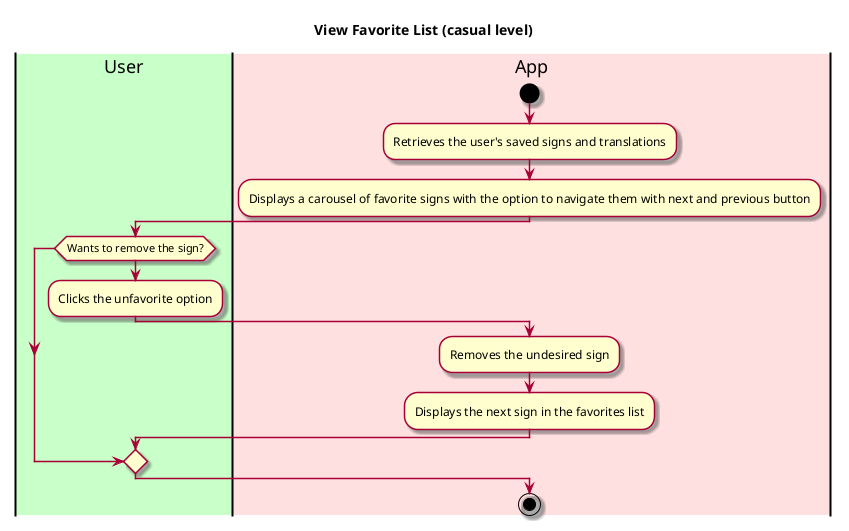

# Use case name: View Favorite List

__Description__:

Users of the ASL app can access and review their stored or favourite sign language translations and gestures using the "View Favourite List" use case. By enabling easy access to frequently used or preferred signage, this feature improves user ease and personalization.

## 1. Primary actor and goals

__User__: Individuals using ASL App who have saved sign language translations and gestures they want to access and view.

## 2. Other stakeholders and their goals

* __Other APP Users__: May want to learn from or share signs with others.
* __Educators__: Facilitate learning and communication for deaf students.

## 2. Preconditions
* The application is launched and operational.
* The user has favorited signs after their search.
* The user has chosen the option to view favorites.
* The user has saved sign language translations or gestures in their favorites list

## 4. Postconditions
*  The user successfully views their saved signs and translations.

## 5. Workflow

## Workflow Description:

- The User wants to view their favorite sign language translations and gestures.
- The User interacts with the View Favorite feature in the App.
- The View Favorite feature accesses the "Favorites" section within the app.
- The System retrieves the user's saved signs and translations from their favorites list.
- The System displays a list of the user's favorite signs.
- The user is given the option to remove the undesired sign.
- The user can go back and see all the signs they favorite.

This workflow represents the main success scenario for the "View Favorite List" use case at a casual level of detail. Users can easily access and review their favorite sign language translations and gestures, enhancing their SignSpeak experience and facilitating communication.

