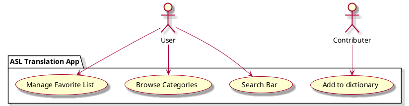

## 1. Introduction:

 [Name of the App] is an android app created to close the communication gap between people who use spoken language and those who rely on sign language for communication. With the help of the Graphics Interchange Format (GIF) short-term caregivers of children, teachers or anyone else may communicate with anyone else by providing translation from text spoken language into sign language even when a sign-language translator is missing. 

## 2. Business Case:

 In a world that promotes inclusivity and communication, there is an urgent need for a tool that facilitates easy interactions between hearing and hearing-impaired groups. [App Name] fills that need. It offers an appealing approach to support persons who are deaf and hard of hearing while making sign language more generally accessible. App potential impact extends to education, healthcare, customer service, and beyond, where effective communication is paramount.

## 3. Key Functionality:
- Search Bar: Translates written words into sign language in real time via GIFs.
- Browse Categories: Look through different collections of signs in dictionary, based on the common theme.
- Favorite: Search and add favorite sign to the collection in the favorite list for easier access.
- Visual and Text Feedback: Animated sign language gestures with accompanying text translations.
- User-Friendly Interface: Intuitive design for users of all backgrounds.
- Colorblind friendly: Support for visually impaired users.

## 4. Stakeholder Goals Summary:

- Deaf and Hard-of-Hearing Individuals:
  - Goal: Effective communication through sign language with the community.
 - Sign Language Learners:
   - Goal: Practice and improve sign language skills.
- Short-term caregivers:
  - Goal: Communicate with children that use ASL.
- Educators and Teachers:
  - Goal: Communicate with hearing impaired students, and potentially enhance sign language teaching methods.
- Families and Friends of the Deaf Community:
  - Goal: Better understanding and communication with loved ones.
- Service Providers (Healthcare, Customer Service, Education):
  - Goal: Facilitate inclusive and accessible communication.

